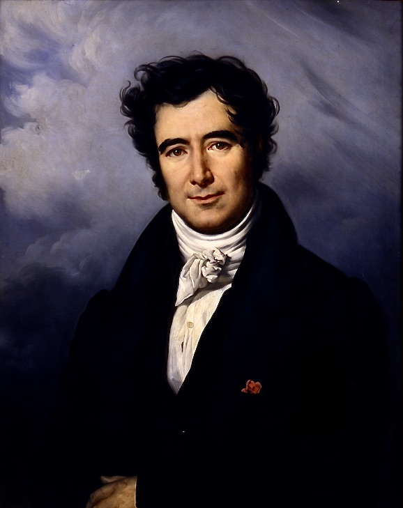

# Before Relativity: The Luminiferous Ether

Prior to 1900, most known wave phenomena (aside from light) were physical, and were known to travel through physical media; more than that, their existence and traversal through those physical media could be derived directly from classical (Newtonian) theory. So when the wave nature of light became clear, many physicists understandably guessed that it also travelled through a medium. This medium couldn't be quite the same as the known physical media of other waves (light was known to travel through a vacuum,  among other things), and so (and as early as the 17th century) many proposed a "luminiferous ether" that permeated all of space, was of a negligible density, had a negligible interaction with matter, and only existed as the medium for light to travel. (By the late 19th century, when light's existence as an electromagnetic phenomenon was understood, this ether would be expanded to account for the propagation of all electromagnetic waves.)

This, of course, leads to some interesting conclusions about the behavior of light. The speed of a wave travelling through a medium is relative to the speed of the medium itself, and a wave of a certain wavelength and type always travels at the same speed in the galilean reference frame of the medium; when a stone splashes into a river, it produces circular ripples on the surface that move along with the flow of the surface of the river. This is all to say that, relative to an observer outside of the medium, a wave travels fastest in the direction of the medium's flow and slowest in the direction opposite to the medium's flow. Hence, if the otherwise undetectable ether is moving relative to an observer, and the ether behaves like known physical media in this respect, the observer should see that light travelling in certain directions is faster than in others. Thus, we should be able to perform a measurement of the speed of the ether relative to the observer, and test the ether theory, if we can measure the relative speed of light in different directions.

This brings us to the Michelson-Morley experiment. 

### The Michelson-Morley Experiment

When two or more waves overlap each other, they form an interference pattern governed in part by their phase relative to each other. As such, if we sets up a light source to send light out through a beamsplitter and down two orthogonal optical pathways of the same length, and merge them again at the end, like so:

where *s* is the light source, *a* (and $a_{1}$) is the beamsplitter(s), $abad$ and $acad$ are the optical paths of the same length, and $e$ is the target where the interference pattern appears, then any shift in the speed of light down one orthogonal path relative to the other will shift the relative phase of the beams, shifting the fringes on the interference pattern. 

If the ether flows at some velocity in the plane of the device, at some angle the flow will be in the direction of one of the orthogonal paths, and the speed will be faster down that path than the other; at some angle the flow will be in the direction of the other path, and which path is faster will be reversed; and at intermediate angles, the relative speed of light down each arm will shift between these two extremes. So if we rotate the device slowly, we should be able to measure a shift in the interference pattern as the angle of the device changes. If we know the usual wavelength and speed of the light used, we can use this measurement to calculate the speed of the ether in the plane of the device.

  
  

  American physicists Albert A. Michelson (1852-1931) (left) and Edward W. Morley (1838-1923) (right)

This is the basic principle behind the design of Albert A. Michelson and Edward W. Morley's famous interferometer in their 1887 experiment (and, in fact, the above schematic comes from their 1887 paper), where they used a version of this device to attempt to measure the speed of the ether relative to the surface of the Earth. 

As the speed of light is quite large, the speed of the ether was likely to be small relative to it, leading to comparatively minute changes in the velocity down each arm. To counter this, Michelson and Morley added a series of mirrors to increase the actual optical path length of each arm of the apparatus; an increase in the distance travelled by the light meant that smaller changes in speed would have a greater impact on the relative phase shift of the light by the time it reached the target, increasing the sensitivity of the device. To reduce vibrational noise and other external noise sources, while still allowing the full apparatus to rotate, they placed the full apparatus on a large stone block suspended in a pool of mercury. The design of the final device, and a picture thereof, are shown below.

They then collected readings of the shifts in the interference fringes as the device rotated, in two batches&mdash;the first at noon, and the other at 6:00PM. This allowed them to collect data on the motion of the ether in two orthogonal planes, meaning that any motion of the ether in any direction relative to the Earth's surface could be detected by the device.

From this, they worked out the speed of the ether and found, astoundingly, found that the motion of the ether relative to the Earth was either extremely low or zero&mdash;but the ether theory wasn't dead yet.

### The Ether Drag Hypothesis

**Corpuscular Theory**

A long competing theory of light to the ether theory was the $corpuscular$ $theory$, which held that light consisted of a multitude of corpuscules (similar to particles, in the modern sense) radiating out from a light source. By this theory, the velocity of light varied not with the velocity of an intervening medium, but with the velocity of the source of emission.

  

  French physicist François Arago (1786-1853)

In 1810, François Arago developed an experiment to test this theory using the phenomenon of stellar aberration. It had long been observed that the apparent position of stars in the sky when viewed by a telescope shifted back and forth over a distance of 41 arcseconds in total over the course of a year. This is due to the shift in the relative velocity of the Earth and the stars over the course of the Earth's orbit; in the time it takes for the light to travel from the star to the telescope, the telescope will have shifted position by an amount relative to the Earth's velocity, and so the image of the star will be shifted by a proportional amount. Arago reasoned, that if the corpuscular theory holds, when a material with a high refractive index (in his case, a prism) was placed between the star and the telescope, the degree of aberration should change when the telescope was pointed in the direction of Earth's motion relative to the star compared to the opposite direction (as the speed of the light relative to the refractive medium would change, changing the degree to which the light was refracted.) However, when he performed the experiment, he found no difference in aberration depending on the direction of the telescope; a result that he felt he could not satisfactorily explain via the corpuscular theory. So he asked his colleague, Augustin-Jean Fresnell, if he could explain it using the wave (and hence ether) theory of light.

**Partial Ether Drag Hypothesis**

  

  French physicist Augustin Jean Fresnel (1788-1827)

The ether theory of wave propagation of light definitely had an advantage over the corpuscular theory, as the velocity of light did not at all depend on the motion of the source of the light, but it produced a similar problem: as the Earth shifts the direction of its velocity over the course of its orbit, if the ether doesn't interact with most physical matter directly at all, the velocity of the ether relative to the Earth should still be significant for at least some portion of the year. Hence, the ether theory would run into the same problem, that light should be faster, and thus refract more, in certain directions than in others. Even worse, as this difference in velocity would depend on the relative motion of the ether and not the source of the light, it should be imminently obvious *even when pointing a telescope through a refractive medium at anything at rest in the telescope's frame of motion.* This was clearly not the case.

But Fresnel found that a slight modification to the ether theory could rescue it entirely: if physical matter dragged a portion of the ether along with it, it would increase the relative density of the ether (and hence change the speed of light) within it, incidentally also lending a theoretical basis for their refractive index, *and* change the relative velocity of the ether within it to a proportion exactly counteracting the additional aberration expected from the relative speed of the ether external to the matter. This became known as the *partial ether drag hypothesis*.

Unfortunately, this still wouldn't explain the null result of the Michelson-Morley experiment, as while the velocity of the ether in the air at the surface of the Earth would be shifted by the velocity of the air, the ether would *still* have an internal velocity in the air itself relative to the apparatus, and so the experiment should have picked up some kind of motion in the ether. 

**Complete Ether Drag Hypothesis**

  

  Irish physicist George Gabriel Stokes (1819-1903)

This problem could be solved if, as George Stokes supposed in 1845, instead of partially dragging the ether, matter dragged the ether completely. Then there would be no relative velocity of the ether in the air around the apparatus, leading to the Michelson-Morley experiment's null result, nor would there be a relative velocity dependent on the direction of the telescope with the prism, as in Arago's experiment. Unfortunately, this also means that the velocity of the Earth relative to the stars would also not properly predict stellar aberration. (Stokes attempted to come up with a variety of solutions to this problem, but all ultimately ran into some problem or another.)

So the partial drag hypothesis accounted for stellar aberration perfectly well, but was thrown out by the Michelson-Morley result, and the complete drag hypothesis accounted for the Michelson result, but not a variety of other factors. To account for all of the known properties of light with the ether theory, physicists needed to come up with some other way to account for both stellar aberration and the result of the Michelson-Morley expleriment.

### Lorentz Contraction

  

  Dutch physicist Hendrik Lorentz (1853-1928)

From 1890 to 1904, Lorentz formulated a set of equations that could account for the then-known properties of light in the ether theory. He found that, when working from Maxwell's equations, and taking both the speed of light in the ether and the velocity of the matter in question relative to the ether into account, the transformations between reference frames could be made simpler by introducing a *local time* of the system, separate but dependent on the *universal time* external to the system. (This idea can be seen as a sort of precursor to time dilation in special relativity.)

To account for the null result of the Michelson-Morley experiment, Lorentz also hypothesized that matter travelling through the ether experiences a *length contraction* proportional to 

$\sqrt{1-{\frac{v^2}{c^2}}}$

where *v* is the speed of the matter and *c* the speed of light through the ether.

Ignoring length contraction, let's take a look at the Michelson-Morley interferometer. Denoting the length of each arm $L_{0}$, and setting the direction of the velocity of the ether to be directly down one of the arms, we find that $T_{1}$, the time taken to travel down and back the arm parallel to the velocity through the ether, is

$T_{1}=\frac{L_{0}}{c-v}+\frac{L_{0}}{c+v}=\frac{2L_{0}c}{c^2-v^2}=\frac{2L_{0}}{c(1-\frac{v^2}{c^2})}$

and $T_{2}$, the time taken to travel down the perpindicular arm, is 

$T_{2}=\frac{2L_{0}}{\sqrt{c^2-v^2}}$

which is clearly different, leading to the phase shift that Michelson and Morley expected.

Now, modifying the length of the arms with Lorentz's contraction factor, we find that $T_{2}$ is unchanged, while $T_{1}$ becomes

$T_{1}=\sqrt{1-{\frac{v^2}{c^2}}}\frac{2L_{0}}{c(1-\frac{v^2}{c^2})}=\frac{2L_{0}}{\sqrt{c^2-v^2}}=T_{2}$

leading to the lack of a phase shift in the experiment *without* necessitating the abandonment of the ether theory. It also had the added benefit of more accurately matching observed stellar aberrations. 

But once again unfortunately for the ether theory, Lorentz's modification too had a fatal flaw: it priveleges one reference frame, that of the ether itself, above all others, and his transformations hence are not quite equivalent when jumping from one non-ethereal reference frame to another. The ether theory, at the time, could yet have been proven correct, but later experiment would show no such priveleged reference frame. This brings us to the final nail in the coffin of the ether theory.

### Einstein's Theory of Special Relativity

In 1905, Albert Einstein published his paper outlining his theory of special relativity. He began with two postulates:

**1. The principle of relativity:** The same laws of physics apply in all inertial reference systems.
**2. The universal speed of light:** The speed of light in a vacuum is the same for all inertial observers, regardless of the motion of the source.

From this he derived a time dilation factor proportional to $\frac{1}{\sqrt{1-\frac{v^2}{c^2}}}$, and the familiar length contraction factor first introduced by Lorentz. This theory accounted for almost all of the discrepancy between the ether theory and the then-known properties of light (and many of the properties of light determined experimentally, though not all&mdash;one notable exception being its quantization), all without requiring a priveleged reference frame or the ether. This brings us to the rest of our project. 

### References

