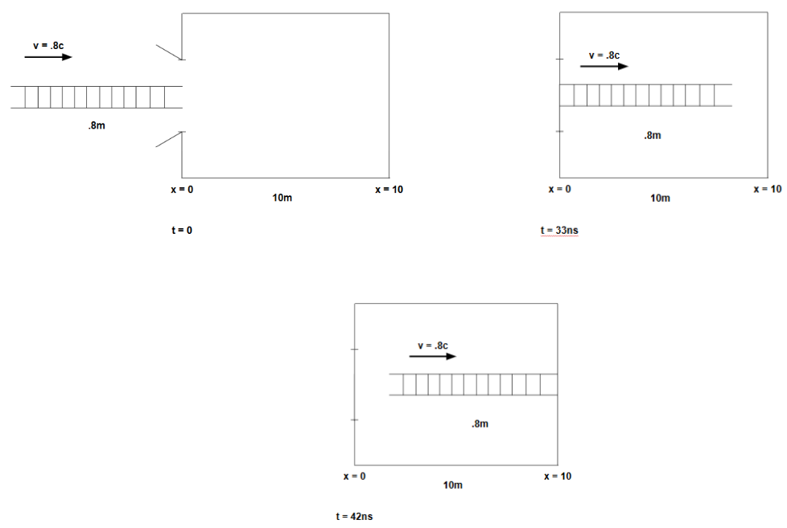
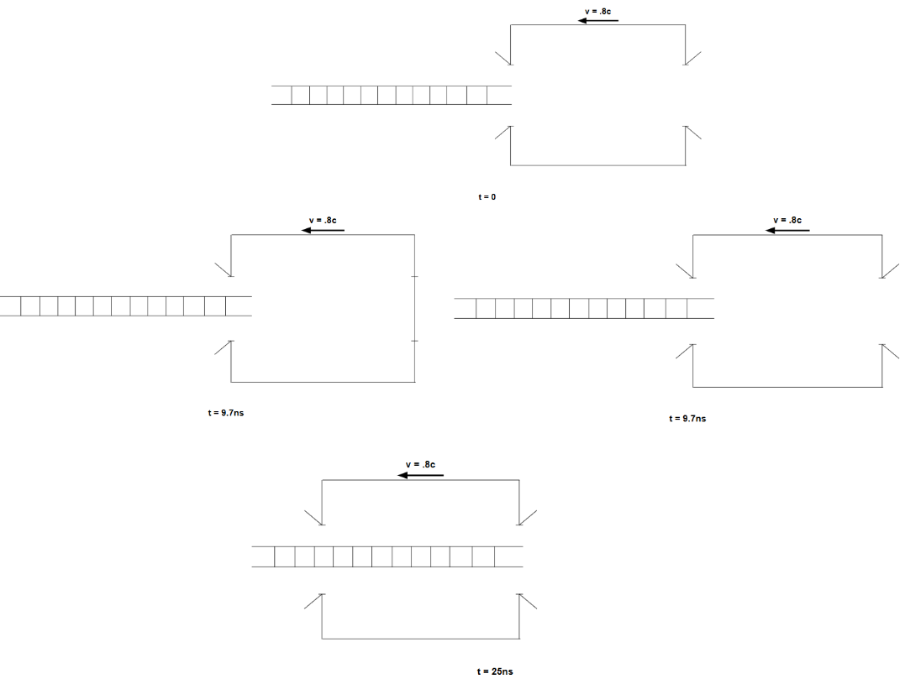
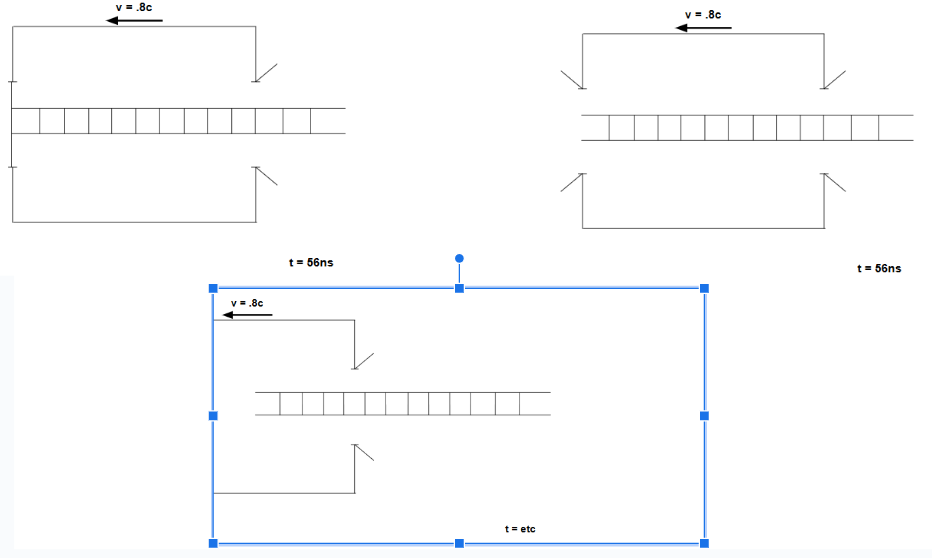

# Apparent Paradoxes: Length Contraction and Simultaneity

### Ladder-Barn Paradox

I'm sure many reading this article are already familiar with the ladder-barn paradox, whereby a ladder moving at near the speed of light appears to fit into the barn in the barn's reference frame, but does not fit into the barn in it's own reference frame, but I will reiterate it here.

Suppose you have a ladder slightly longer than the length of a barn (let's say 4/3 of the barn's length), and you want to find a way to fit it into the barn. You remember that objects travelling near the speed of light experience Lorentz contraction, so if you move the ladder into the barn fast enough (let's say .8c), you feel you should be able to fit the ladder into the barn and close the door.

In your reference frame, the ladder, as the moving object, will be contracted by the factor

$\sqrt{1-{\frac{v^2}{c^2}}}=\sqrt{1-{.8^2}}=.6$

and so it's length as a portion of the barn's length will become $\frac{4}{3}(.6)=\frac{4}{5}$ of the barn's length, and hence will fit in the barn. So, your reasoning goes, the ladder will enter the barn fully, and then you will close the barn door, and then the ladder will be in the barn. And that seems all well and good. So what happens in the ladder's reference frame?

Well, now it is not the ladder that is moving, but the barn; so instead of the ladder contracting, the barn will contract&mdash;so the ladder will go from $\frac{4}{3}$ of the barn's length to $\frac{20}{9}$ of the barn's length, and will therefore be even less likely to fit into the barn. 

In the barn's reference frame, the ladder will fit into the barn; but in the ladder's reference frame, the ladder will *never* fit into the barn. So how do we resolve this?

Let's say the barn is 10m long, start the x-axis at the entrance of the barn, and set the time that the front of the ladder crosses the threshold is at $t=0$. In the barn's reference frame, the front of the ladder enters the barn at $t=0s$, then the back end of the ladder enters the barn at about $t=33ns$, then the barn door closes (then the front of the ladder hits the rear of the barn at about $t=42ns$). 

But in the ladder's reference frame, the effect of time dilation changes the order of events.
Time dilation follows the equation

$t=\gamma(t'+\frac{v}{c^2}x')$

where $x'$ and $t'$ are the proper length and proper time, respectively (and $\gamma$ is the factor $\frac{1}{\sqrt{1-{\frac{v^2}{c^2}}}}$). In the ladder's frame, the barn is moving at $-.8c$; in the barn's frame, the time the ladder hits the rear of the barn is $t'=42ns$, and the position of the rear of the barn is $x'=10m$, so the equation for the time the ladder hits the rear of the barn in the ladder's frame becomes:

$t=\gamma(42ns-\frac{.8c}{c^2}10m)=25ns$

Similarly, the time the back end of the ladder enters the barn / the barn door closes in the ladder's frame becomes:

$t=\gamma(33ns-\frac{.8c}{c^2}(0m))=56ns$

That is, the ladder hits the end of the barn *before* the barn door closes. So who's right? Special relativity does not priveledge any reference frame over any other, so neither is more correct than the other; more precisely, they're *both* correct. If this seems strange to you, consider the following:

You cannot stop the ladder from hitting the back wall once it enters the barn. If this, too, seems strange, remember what has to happen for the ladder to turn around. It cannot instantaneously change direction to head backwards; it must slow down, then stop, then speed up in the opposite direction. Hence, there must be a point where the ladder is completely stopped; a moment where Lorentz contraction no longer applies to it, even in the barn's frame. Once it has passed the point where, in its own reference frame, it has hit the back of the barn, it has also gotten close enough to the back in the barn's reference frame that even an instantaneous stop would result in the ladder suddenly accordioning out like a cartoon and smashing the barn's wall to smithereens.

So, while the ordering of events, and what an observer sees, can be quite different in different reference frames, both frames agree on the ultimate outcome of this sequence of events; your barn will be about as totaled as a barn can be.

So what happens, if, instead of a barn with a single entrance, we try to pass the ladder through a tunnel?

### Ladder-Tunnel Paradox

Suppose we take a ladder of the same length, and a tunnel of the same length as the barn, send the ladder throiugh the tunnel at the same speed as in the previous example, and, at the moment the ladder is fully in the tunnel in our reference frame, simultaneously close both entrances and then instantaneously open them again. What happens now?

Given the result of the ladder with the barn, one may be inclined to believe that the ladder will be fine in the tunnel's reference frame, but be destroyed in its own frame; or perhaps it will be destroyed in both frames. But neither is the case; the ladder will pass fully through the tunnel, unharmed, in both cases.

Here, the supposed paradox is resolved by the aforementioned lack of simultaneity. 
As can be expected, in the tunnel's reference frame, the front of the ladder enters the tunnel at time $t=0$. Then the back half of the ladder enters the tunnel at about $t=33ns$, and the entrances simultaneously close, then open.

In the ladder's reference frame, the front half of the ladder enters the tunnel at time $t=0$. But now, the door at the end of the tunnel closes and opens at time

$t=\gamma(33ns-\frac{.8c}{c^2}(10m))=9.7ns$

Then the front of the ladder exits the tunnel at about $t=25ns$, then the back end of the ladder enters the tunnel and the rear door closes and opens at about $t=56ns$.

So we again find that, while the ordering of events differs significantly in both frames, both agree on what ultimately happens to the ladder and the tunnel&emdash;and we find that these aren't really paradoxes at all, we're just used to thinking of things in very nonrelatavistic terms.
